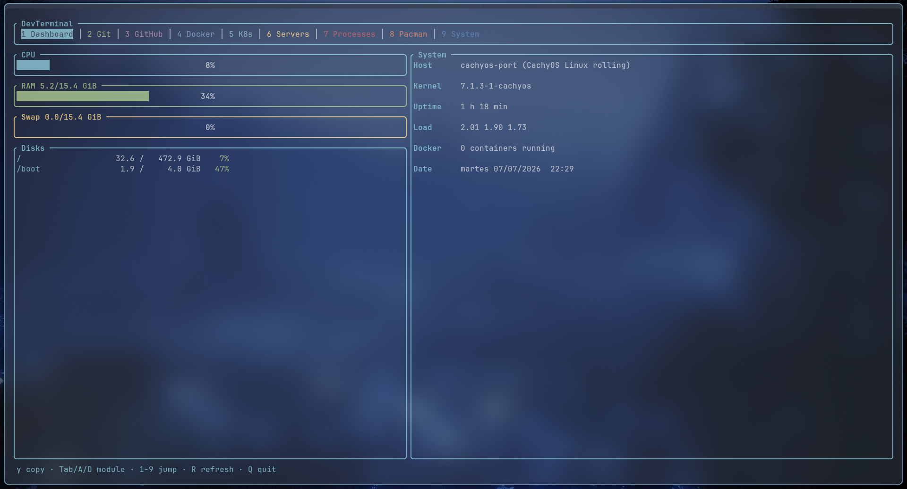

# DevTerminal

**Terminal Workspace Manager for Linux and Windows.** A TUI that centralizes the administration of your development environment in a single, fully keyboard-driven interface.

DevTerminal reimplements nothing: it acts as a unified control panel over the tools you already use — `git`, `gh`, `docker`, `kubectl`, your system package manager, the system log, `ssh` — so you can stop juggling terminals and remembering flags.

## Screenshots



## Modules

| # | Module | What it does |
|---|--------|--------------|
| 1 | **Dashboard** | CPU, RAM, swap, GPU (NVIDIA, via `nvidia-smi`) and disks with gauges; uptime, load, kernel, running Docker containers and date |
| 2 | **Git** | Contextual: detects the repo of the current directory or offers the ones in your workspaces. Status with stage/unstage, diff (full-screen via [`delta`](https://github.com/dandavison/delta) if installed), edit with `$EDITOR`, commit, pull, push, fetch, graph log and branch checkout |
| 3 | **GitHub** | Repos, issues, PRs and Actions via `gh`: details, open in browser, re-run workflows. Pin a context repo with `Space` to operate outside the cwd |
| 4 | **Docker** | Containers, images, volumes, networks and Compose projects: start/stop/restart, logs, shell, inspect, delete, prune, `compose up/down` |
| 5 | **K8s** | Pods, deployments, services, nodes and namespaces (`-A`): logs, exec, rollout restart, scale replicas, delete |
| 6 | **Servers** | Listening development ports (filtered by a whitelist of ~600 typical ports: vite, flask, postgres, n8n, ollama…) shown as clickable URLs, with a warning when exposed to the network; SSH hosts from `~/.ssh/config` and your own config (connect, `ssh-copy-id`, `ssh-keygen`); and networking: interfaces, gateway, DNS, ping and traceroute |
| 7 | **Processes** | Sorted by CPU with live filter; kill, force-kill, change priority |
| 8 | **Packages** | Pending updates, search, install, remove and clean cache through whichever manager the system has: `paru`/`yay`/`pacman`, `apt`, `dnf`, `zypper`, `apk`, `winget`, `scoop` or `choco` |
| 9 | **System** | The system log with scrolling and errors-only filter (`journalctl`, or the System+Application event logs) + services: per-unit log, start/stop/restart |

## Platforms

One binary per system; the code picks the native tool at run time. Every OS difference lives in `src/platform.rs` or in an `if platform::WIN` branch inside the module — decided with `cfg!()` and **not** `#[cfg]`, so both branches always compile and pass the tests on any machine.

| | Linux | Windows |
|---|---|---|
| Packages | `paru`/`yay`/`pacman`, `apt`, `dnf`, `zypper`, `apk` | `winget`, `scoop`, `choco` |
| Log and services | `journalctl` + `systemctl` | System/Application event logs + Windows services |
| Ports | `ss -tlnp` | `netstat -ano` (+ process name via sysinfo) |
| Network | `ip`, `/etc/resolv.conf` | PowerShell `Get-Net*` cmdlets |
| Privileges | `sudo` | UAC (`Start-Process -Verb RunAs`) |
| Clipboard | `wl-copy` / `xclip` / `xsel` | `clip` |
| Open URL · notifications | `xdg-open` · `notify-send` | `start` · tray balloon |
| Config | `~/.config/devterminal/config.toml` | `%APPDATA%\devterminal\config.toml` |

## Philosophy

- **Wrap, don't reimplement.** No bindings or SDKs: each module launches the official CLI (`git`, `gh`, `docker`, `kubectl`…) and presents its output. If you know the tool, you already know what DevTerminal does under the hood.
- **100% keyboard.** No workflow requires the mouse (although port URLs can be opened with Ctrl+click).
- **No secrets of its own.** DevTerminal stores no tokens: GitHub is used through `gh`, which already manages its authentication in the system keyring.
- **Destructive actions always ask for confirmation** (deleting containers, killing processes, `compose down`, prune…).

## Installation

Full guide, per distribution and for Windows: **[INSTALL.md](INSTALL.md)** — prebuilt binaries, building from source, optional tools, platform notes and troubleshooting.

Quick start from source (needs Git and [rustup](https://rustup.rs)):

```bash
git clone https://github.com/tomgutgar/DevTerminal.git
cd DevTerminal
cargo install --path .   # puts the `devc` binary in ~/.cargo/bin
devc
```

- **Debian/Ubuntu, Fedora, openSUSE, Alpine:** install a C linker first (`build-essential`, `gcc` or `build-base`) and use rustup rather than the distro's `rustc`.
- **Windows:** Rust needs a linker — either the Visual Studio Build Tools (MSVC) or WinLibs MinGW (GNU toolchain). Both are one `winget` command; see [INSTALL.md](INSTALL.md#windows-1). Use Windows Terminal.

Each module detects whether its tool (`gh`, `docker`, `kubectl`, `delta`…) is missing and says so on screen; install only what you use — per-platform commands in [INSTALL.md](INSTALL.md#optional-tools).

## Usage

### Global keys

| Key | Action |
|---|---|
| `Tab` / `D` · `Shift+Tab` / `A` | Next · previous module |
| `1`–`9` | Jump straight to a module |
| `W` / `S` (or arrows) | Move selection in lists |
| `/` or `F` | Filter the list live (`Esc` clears) |
| `v` | Switch views inside a module (e.g. Docker: containers → images → volumes…) |
| `Enter` | Main action (diff, logs, connect, details…) |
| `y` | Copy the selection to the clipboard (pid, hash, URL, path…) |
| `R` | Refresh |
| `Esc` | Close overlay (pane, confirmation, prompt) |
| `Q` | Quit |

Every module shows **its own shortcuts in the bottom bar**. Some examples: in Git `Space` stages/unstages and `c` opens the commit prompt; in Docker `u`/`x`/`t` are start/stop/restart and `e` opens a shell inside the container; in Processes `k` kills the selected process.

Interactive commands (ssh, shells, `pacman -Syu`, `winget upgrade`, ping…) suspend the TUI, hand you the full terminal, and return you where you were when they exit.

### Configuration (optional)

File at `~/.config/devterminal/config.toml` on Linux (`$XDG_CONFIG_HOME` is honored) or `%APPDATA%\devterminal\config.toml` on Windows. If it doesn't exist, defaults are used. `~` expands to `$HOME` / `%USERPROFILE%`.

```toml
# Color theme: re-colors the whole TUI
theme = "nord"           # nord (default) · catppuccin · gruvbox

# Directories to look for repos in when devc is launched outside one
# (one level only; the disk is never scanned)
workspaces = ["~/Projects"]

# Servers for the Servers module, in addition to ~/.ssh/config
[[servers]]
alias = "vps"
host = "1.2.3.4"
user = "root"
port = 22
desc = "Main VPS"
```

## Architecture

A single binary crate in Rust on top of [ratatui](https://ratatui.rs):

```
src/main.rs           Event loop, App and overlays (confirm / prompt / pane)
src/runner.rs         Command execution, binary detection (PATH + PATHEXT), clipboard, notifications
src/platform.rs       Windows/Linux differences: open URL, kill, priority, elevate, editor, PowerShell, date
src/theme.rs          Color palettes (nord / catppuccin / gruvbox)
src/ui.rs             Shared ListView (selection + filter) and drawing helpers
src/config.rs         TOML config
src/modules/          Module trait + one file per module (9 modules)
```

Each module implements the `Module` trait (`refresh`, `draw`, `on_key`, `footer`) and returns actions (`Run`, `Interactive`, `Prompt`, `Show`) that the main loop executes — confirmation dialogs and output panes are a single shared implementation.

Dependencies are minimal on purpose: `ratatui`, `sysinfo`, `serde` + `toml`, `anyhow` and `chrono` (just for the local date, which `date +%A` can't provide on Windows). The parsers (git porcelain, `ss`, `netstat`, `compose ls`, `~/.ssh/config`, package-manager output) are plain-text with tests, no serde_json.

## Tests

```bash
cargo test
```

## License

[GPL-3.0-or-later](LICENSE) — free software: you can use, study, modify and redistribute it; derivative works must remain under the same license.
